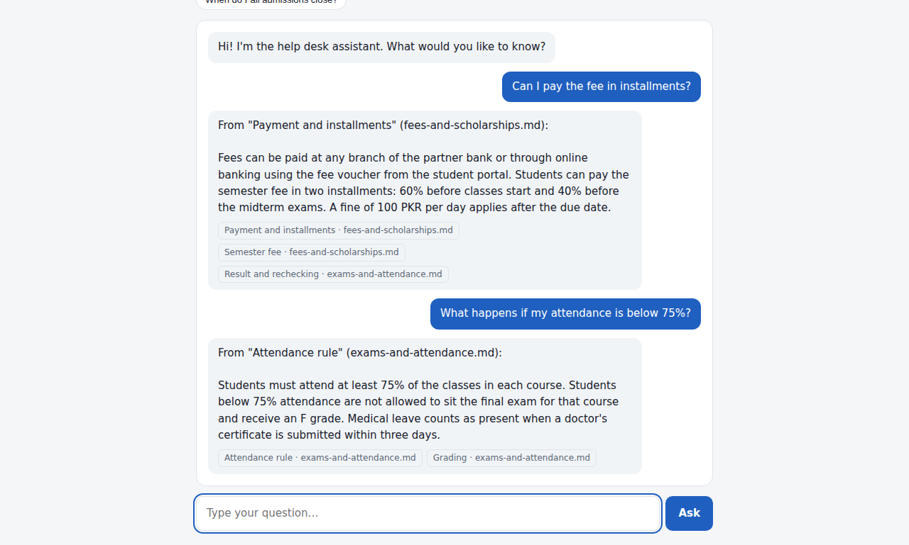

# Campus Help Desk — AI Document Q&A Chatbot (RAG)

A small chatbot that answers questions **only from your own documents**. It uses retrieval-augmented generation (RAG): it finds the most relevant passages in the documents, then an AI model writes an answer that cites them.

The sample documents describe **Riverside Institute of Technology**, a fictional institute (admissions, fees, scholarships, exams and attendance). Replace them with any business's FAQs, policies or manuals.



## Features

- Answers from your `.md` / `.txt` files in the `docs` folder
- Shows which document and section each answer came from
- **AI mode** with OpenAI embeddings and a chat model
- **Demo mode** with built-in BM25 keyword search — runs with no API key and no cost
- Simple web chat interface with suggested questions
- Automated tests

## Tech stack

Python · FastAPI · OpenAI API (embeddings + chat) · BM25 retrieval · HTML/CSS/JavaScript

## Run it

```bash
python -m venv .venv
.venv\Scripts\activate          # Windows  (macOS/Linux: source .venv/bin/activate)
pip install -r requirements.txt
uvicorn app:app --reload
```

Open http://127.0.0.1:8000

### Turn on AI mode

1. Copy `.env.example` to `.env`
2. Put your OpenAI API key after `OPENAI_API_KEY=`
3. Restart the server — the badge changes from "Demo mode" to "AI mode"

Never commit your `.env` file or API key to GitHub.

## Deploy on Vercel

Vercel detects the FastAPI `app` in `app.py` automatically, and `vercel.json` gives the function up to 30 seconds per request.

1. Sign in at [vercel.com](https://vercel.com) with GitHub → **Add New → Project** → import this repository.
2. Leave the settings as they are and click **Deploy**. It runs in demo mode with no API key.
3. For AI mode: Project → **Settings → Environment Variables** → add `OPENAI_API_KEY` (optionally `OPENAI_MODEL`), then **Redeploy**.

## Use your own documents

Put `.md` or `.txt` files in `docs/` and restart. Headings (`#`, `##`) become the section names shown under each answer.

## Tests

```bash
pip install pytest httpx
pytest
```

## How it works

1. Documents are split into sections by heading, then into ~120-word chunks.
2. Each chunk is embedded (AI mode) or indexed with BM25 (demo mode).
3. A question is matched against the chunks and the top 3 are retrieved.
4. In AI mode, the chat model answers using only those chunks and cites them.

## Ideas to extend

- PDF and Word upload
- Store embeddings in a vector database (Chroma, pgvector)
- Chat history and follow-up questions
- Embed as a widget on a website
- Switch to the Claude API or another model
